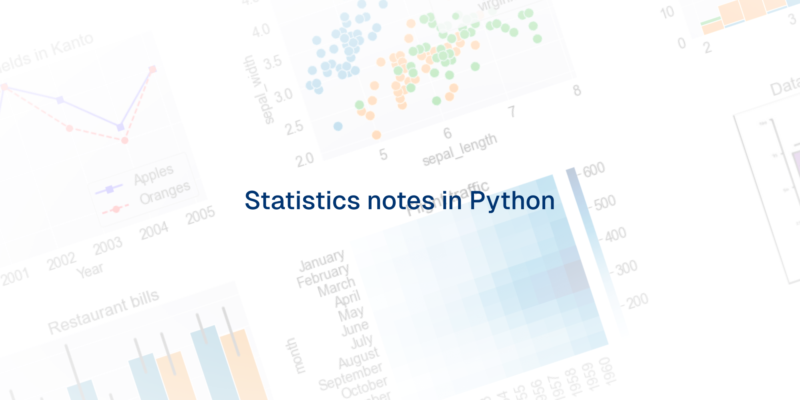

# Statistics notes in python

This repository serves as a comprehensive collection of my personal notes, code snippets, and practical examples focused on Statistics and Machine Learning using Python.

As I navigate through concepts and code, I'm curating a collection of notes, code snippets, and practical examples that reflect my journey from a beginner to an adept practitioner in these domains.

# Why This Repository?

- **Learning Together**: Join me as I explore fundamental statistical concepts and delve into the world of Machine Learning. As I uncover new techniques and methods, I share my insights and discoveries here.

- **Hands-on Exploration**: Dive into Python-based implementations, from simple statistical analyses to the deployment of complex ML algorithms. Together, we'll understand the theory behind these concepts and see them in action through code.

- **Growth Mindset**: Embracing the learning curve, I aim to make this repository a reflection of my progress, learning from mistakes, and refining my understanding with each new concept I encounter.

## Resources
- https://realpython.com/python-statistics/#measures-of-correlation-between-pairs-of-data
- Practical Statistics for Data Scientist 